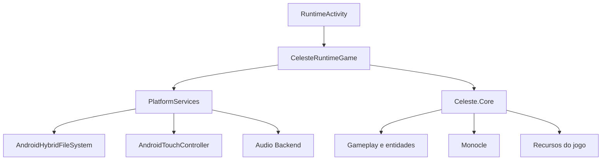

<p align="center">
  
</p>

<h1 align="center">Celeste Android</h1>

<p align="center">
  Uma adaptação do <strong>Celeste</strong> para Android, construída em <strong>C#</strong> com <strong>.NET 9</strong>, <strong>MonoGame</strong> e <strong>FMOD</strong>, mantendo o coração do jogo original e adicionando uma camada focada em toque, compatibilidade, desempenho e estabilidade em dispositivos móveis.
</p>

<p align="center">
  
  
  
  
  
</p>

<p align="center">
  
</p>

## ✨ Seja muito bem-vindo

Se você chegou agora, esse README foi escrito para te ajudar a entender o projeto de verdade.

A ideia aqui não é só dizer “como roda”, mas explicar com clareza **o que esse repositório é**, **como ele está organizado**, **o que ele usa por dentro**, **o que você precisa ter para compilar** e, principalmente, **como gerar a versão Android sem se perder na estrutura dos arquivos**.

Esse projeto não é apenas uma cópia simples do jogo base. Ele reúne o núcleo clássico do Celeste com uma camada Android bem trabalhada, trazendo controles touch, empacotamento de assets para APK, bibliotecas nativas do FMOD, ajustes de runtime e uma organização que tenta deixar o port mais sólido para celular.

## 📚 Sumário

- [O que é este projeto](#-o-que-é-este-projeto)
- [O que você vai encontrar aqui](#-o-que-você-vai-encontrar-aqui)
- [Tecnologias utilizadas](#-tecnologias-utilizadas)
- [Arquitetura geral](#-arquitetura-geral)
- [Estrutura do repositório](#-estrutura-do-repositório)
- [O que é necessário para compilar](#-o-que-é-necessário-para-compilar)
- [A pasta Content e onde ela precisa ficar](#-a-pasta-content-e-onde-ela-precisa-ficar)
- [Como compilar para Android](#-como-compilar-para-android)
- [Saída da compilação](#-saída-da-compilação)
- [Recursos Android incluídos no projeto](#-recursos-android-incluídos-no-projeto)
- [Detalhes importantes para quem vai mexer no código](#-detalhes-importantes-para-quem-vai-mexer-no-código)
- [Solução de problemas](#-solução-de-problemas)
- [Imagens usadas neste README](#-imagens-usadas-neste-readme)

## 🎮 O que é este projeto

Este repositório é uma **base do Celeste adaptada para Android**.

Na prática, ele mantém a lógica principal do jogo no módulo `Celeste.Core` e usa um projeto separado chamado `Celeste.Android` para cuidar da parte mobile. Essa camada Android é responsável por inicialização, serviços de plataforma, empacotamento dos arquivos do jogo, bibliotecas nativas, integração com áudio e controles por toque.

O resultado é um projeto que preserva a base clássica do Celeste e ao mesmo tempo adiciona uma estrutura própria para funcionar em Android de forma mais consistente.

## 🧭 O que você vai encontrar aqui

<table>
  <tr>
    <td><strong>Gameplay clássico</strong></td>
    <td>Grande parte da base do jogo continua no núcleo compartilhado, com a lógica principal do Celeste preservada.</td>
  </tr>
  <tr>
    <td><strong>Camada Android dedicada</strong></td>
    <td>Existe um projeto próprio para Android com Activity, runtime, serviços de plataforma e empacotamento de assets.</td>
  </tr>
  <tr>
    <td><strong>Controles touch</strong></td>
    <td>O projeto inclui controles virtuais, analógico, botões customizados e recursos para adaptar a experiência ao toque.</td>
  </tr>
  <tr>
    <td><strong>Áudio com FMOD</strong></td>
    <td>As bibliotecas nativas do FMOD já estão integradas ao empacotamento Android.</td>
  </tr>
  <tr>
    <td><strong>Assets customizados</strong></td>
    <td>Há pastas extras para imagens e arquivos <code>.dat</code> usados nos controles e no analógico.</td>
  </tr>
  <tr>
    <td><strong>Ferramenta auxiliar</strong></td>
    <td>O diretório <code>tools/IconDatPacker</code> serve para empacotar imagens em arquivos <code>.dat</code>.</td>
  </tr>
</table>

## 🛠️ Tecnologias utilizadas

| Tecnologia | Papel no projeto |
| :-- | :-- |
| **C#** | Linguagem principal do código-fonte |
| **.NET 9** | Base de compilação do projeto |
| **.NET for Android** | Target Android usado no projeto `Celeste.Android` |
| **MonoGame 3.8** | Framework principal para renderização, loop do jogo e integração com plataforma |
| **Monocle** | Estrutura usada pelo jogo para cenas, entidades e fluxo interno |
| **FMOD 11.014** | Sistema de áudio com bibliotecas nativas para Android |
| **Android SDK** | Necessário para compilar e empacotar o APK/AAB |
| **OpenJDK / Java SDK** | Necessário para toolchain Android |

### Pacotes e targets mais importantes

O projeto Android usa:

- `net9.0-android`
- `MonoGame.Framework.Android`
- `MonoGame.Content.Builder.Task`

O núcleo compartilhado usa:

- `net9.0`
- `MonoGame.Framework.DesktopGL`

## 🧩 Arquitetura geral



### Leitura rápida da arquitetura

- `RuntimeActivity` é a porta de entrada no Android.
- `CelesteRuntimeGame` inicializa o jogo em cima da camada mobile.
- `PlatformServices` organiza serviços específicos da plataforma.
- `AndroidHybridFileSystem` ajuda o jogo a ler tanto assets empacotados quanto arquivos externos do app.
- `AndroidTouchController` cuida dos controles touch.
- `Celeste.Core` concentra a lógica principal do jogo.

## 🗂️ Estrutura do repositório

```text
CELESTECOD/
├─ Content/
├─ src/
│  ├─ Celeste.Android/
│  └─ Celeste.Core/
├─ FMOD-11.014/
├─ CONTROLES CELESTE/
├─ ARQUIVOSPARAOANALOGICO/
└─ tools/
   └─ IconDatPacker/
```

### Pastas principais

#### `src/Celeste.Core`
Aqui está o coração do projeto. É onde fica a maior parte da lógica do jogo, gameplay, entidades, integração com a base Monocle e recursos centrais.

#### `src/Celeste.Android`
É o projeto Android propriamente dito. Ele referencia `Celeste.Core`, declara o target `net9.0-android`, define o `ApplicationId`, o empacotamento de assets e inclui as bibliotecas nativas necessárias.

#### `FMOD-11.014`
Contém as bibliotecas nativas do FMOD usadas no Android, incluindo arquivos como `libfmod.so`, `libfmodstudio.so` e `fmod.jar`.

#### `CONTROLES CELESTE`
Pasta com ícones customizados para os botões de toque.

#### `ARQUIVOSPARAOANALOGICO`
Pasta com os assets do analógico virtual.

#### `tools/IconDatPacker`
Ferramenta auxiliar usada para transformar PNG em arquivos `.dat` usados pelos ícones e controles.

## 💻 O que é necessário para compilar

Antes de tentar gerar APK ou AAB, você precisa preparar o ambiente.

| Item | Necessário | Observação |
| :-- | :-- | :-- |
| **.NET 9 SDK** | Sim | O projeto Android mira `net9.0-android` |
| **Workload Android do .NET** | Sim | Sem isso o target Android não compila |
| **Android SDK** | Sim | É importante ter ferramentas como `cmdline-tools`, `platform-tools` e `build-tools` disponíveis |
| **Java SDK / OpenJDK 17** | Sim | A toolchain Android depende dele |
| **Visual Studio 2022 17.12+ ou CLI** | Recomendado | Para quem usa IDE, essa faixa é a mais adequada para projetos `net9.0` |
| **Variáveis `JAVA_HOME` e `ANDROID_HOME`** | Recomendado | Ajudam a evitar erro de configuração de ambiente |
| **Pasta `Content` na raiz** | Sim | Sem ela o projeto fica sem os arquivos esperados do jogo |
| **FMOD-11.014 presente** | Sim | O `.csproj` referencia bibliotecas dessa pasta |

> [!IMPORTANT]
> O projeto foi configurado para compilar o Android a partir do arquivo `src/Celeste.Android/Celeste.Android.csproj`. Não existe uma solução `.sln` obrigatória no pacote analisado, então o caminho mais direto é compilar o `.csproj` Android.

> [!TIP]
> Em Windows, a experiência costuma ser mais simples quando o Android SDK e o Java SDK já estão configurados corretamente no sistema.

> [!NOTE]
> Se você estiver configurando o ambiente manualmente, vale conferir se `JAVA_HOME` aponta para o OpenJDK e se `ANDROID_HOME` aponta para o Android SDK. Isso evita boa parte dos erros comuns de primeira compilação.

## 📦 A pasta Content e onde ela precisa ficar

Esse é o ponto mais importante de todo o processo.

A pasta `Content` precisa ficar **na raiz do projeto**, no mesmo nível de `src`, `FMOD-11.014`, `CONTROLES CELESTE` e `tools`.

### Estrutura correta

```text
CELESTECOD/
├─ Content/
├─ src/
├─ FMOD-11.014/
├─ CONTROLES CELESTE/
├─ ARQUIVOSPARAOANALOGICO/
└─ tools/
```

### Por que isso importa

O projeto Android foi configurado para empacotar os arquivos da pasta `Content` através deste padrão:

```xml
<AndroidAsset Include="../../Content/**/*.*"
              Condition="Exists('../../Content')"
              Link="Content/$([System.String]::Copy('%(RecursiveDir)').Replace('\\','/'))%(Filename)%(Extension)"
              LogicalName="Content/$([System.String]::Copy('%(RecursiveDir)').Replace('\\','/'))%(Filename)%(Extension)" />
```

Como esse caminho é relativo ao arquivo `src/Celeste.Android/Celeste.Android.csproj`, a pasta precisa estar exatamente dois níveis acima dele.

> [!WARNING]
> Se a pasta `Content` estiver em outro lugar, o build não vai empacotar os assets corretamente no APK.

> [!NOTE]
> No pacote analisado, a pasta `Content` não veio junto dentro do ZIP. Então, se você estiver montando o repositório ou o ambiente manualmente, precisa garantir que ela exista nesse local antes da compilação Android.

## 🚀 Como compilar para Android

### 1. Instale a workload Android do .NET

```bash
dotnet workload install android
```

### 2. Entre na raiz do projeto

```bash
cd CELESTECOD
```

### 3. Restaure os pacotes

```bash
dotnet restore src/Celeste.Android/Celeste.Android.csproj
```

### 4. Faça uma compilação inicial

```bash
dotnet build src/Celeste.Android/Celeste.Android.csproj -c Release
```

Se o ambiente estiver correto, essa etapa já deve validar boa parte da toolchain.

### 5. Gere um APK

```bash
dotnet publish src/Celeste.Android/Celeste.Android.csproj \
  -c Release \
  -f net9.0-android \
  -p:AndroidPackageFormats=apk
```

### 6. Gere um AAB

```bash
dotnet publish src/Celeste.Android/Celeste.Android.csproj \
  -c Release \
  -f net9.0-android \
  -p:AndroidPackageFormats=aab
```

### 7. Caso queira gerar os dois formatos

```bash
dotnet publish src/Celeste.Android/Celeste.Android.csproj \
  -c Release \
  -f net9.0-android \
  -p:AndroidPackageFormats="aab;apk"
```

### 8. Build rápido para testes locais

Se a sua ideia for apenas testar a base, normalmente isso já ajuda bastante:

```bash
dotnet build src/Celeste.Android/Celeste.Android.csproj -c Debug
```

## 📁 Saída da compilação

Depois do build e do publish, os arquivos gerados costumam aparecer dentro de algo próximo a:

```text
src/Celeste.Android/bin/Release/net9.0-android/
```

E, ao usar `publish`, normalmente você também verá a saída em:

```text
src/Celeste.Android/bin/Release/net9.0-android/publish/
```

### O que procurar

- Arquivo `.apk` para instalação direta em dispositivo
- Arquivo `.aab` para publicação em loja
- Diretórios intermediários de build do Android

## 📱 Recursos Android incluídos no projeto

O projeto não se limita a abrir o jogo no Android. Ele traz uma camada pensada para o ambiente mobile.

### Controles touch

Há um sistema de toque dedicado que trabalha com botões customizados, analógico virtual e integração com o input do jogo.

### Empacotamento de assets do jogo

A pasta `Content` é embutida como `AndroidAsset`, o que permite levar os arquivos necessários para dentro do APK.

### Assets customizados de controle

As pastas `CONTROLES CELESTE` e `ARQUIVOSPARAOANALOGICO` também entram como assets do Android.

### Bibliotecas nativas do FMOD

O `.csproj` Android inclui as bibliotecas nativas para:

- `armeabi-v7a`
- `arm64-v8a`

### Configuração Android declarada no projeto

| Configuração | Valor |
| :-- | :-- |
| `TargetFramework` | `net9.0-android` |
| `SupportedOSPlatformVersion` | `21` |
| `ApplicationId` | `celestegame.app` |
| `ApplicationTitle` | `CELESTE` |
| `minSdkVersion` | `21` |
| `targetSdkVersion` | `35` |
| ABIs declaradas | `android-arm;android-arm64` |

## 🔎 Detalhes importantes para quem vai mexer no código

<details>
  <summary><strong>Onde fica o núcleo do jogo</strong></summary>

O módulo `Celeste.Core` concentra a maior parte da lógica real do jogo. Se a sua intenção é mexer em gameplay, entidades, regras, fluxo de cena e comportamento do Celeste em si, é aqui que você vai passar mais tempo.

</details>

<details>
  <summary><strong>Onde fica a entrada do Android</strong></summary>

O ponto de entrada mobile está ligado à `RuntimeActivity`, que inicializa o runtime Android e cria a instância do jogo para execução na plataforma.

</details>

<details>
  <summary><strong>Como os arquivos do jogo entram no APK</strong></summary>

Os arquivos da pasta `Content` não entram automaticamente “por magia”. Eles são incluídos porque o projeto Android declara explicitamente um `AndroidAsset Include="../../Content/**/*.*"` no `.csproj`.

</details>

<details>
  <summary><strong>Controles e ícones customizados</strong></summary>

Além da pasta `Content`, o projeto também empacota PNG e `.dat` das pastas `CONTROLES CELESTE` e `ARQUIVOSPARAOANALOGICO`, criando diretórios internos como `controls_custom` e `analog_custom` no pacote Android.

</details>

<details>
  <summary><strong>FMOD e bibliotecas nativas</strong></summary>

A integração de áudio depende da pasta `FMOD-11.014`. O projeto Android referencia diretamente os arquivos `.so` e o `fmod.jar`. Se essa pasta não estiver presente no layout esperado, o build vai falhar.

</details>

## 🧯 Solução de problemas

### O build não encontra a workload Android

Verifique se você executou:

```bash
dotnet workload install android
```

### O build reclama de SDK Android ou Java

Confira se o Android SDK e o Java SDK estão instalados e configurados corretamente no sistema.

### O APK é gerado, mas sem os dados do jogo

Quase sempre isso significa que a pasta `Content` não estava no lugar esperado no momento da compilação.

### O projeto não encontra FMOD

Confirme se a pasta `FMOD-11.014` está presente na raiz do repositório e se os arquivos `.so` e `fmod.jar` existem nos caminhos referenciados pelo `.csproj`.

### O repositório não tem `.sln`

Tudo bem. Compile diretamente o arquivo:

```text
src/Celeste.Android/Celeste.Android.csproj
```

## 🖼️ Imagens usadas neste README

As imagens usadas aqui foram referenciadas a partir da wiki/fandom de Celeste para deixar a apresentação do repositório mais bonita e mais próxima da identidade visual do jogo.

- Logo de Celeste
- Splash art de Celeste

<p align="center">
  
</p>

## 💙 Considerações finais

Esse projeto é uma base muito interessante para quem quer estudar a estrutura do Celeste em conjunto com uma adaptação para Android. Ele mostra uma separação clara entre o núcleo do jogo e a camada de plataforma, além de trazer uma solução prática para empacotamento de conteúdo, controles móveis e integração de bibliotecas nativas.

Se a sua intenção for continuar evoluindo esse repositório, o caminho natural é manter três pontos sempre bem alinhados:

1. a estrutura da pasta `Content`
2. a saúde da toolchain Android
3. a consistência entre `Celeste.Core` e `Celeste.Android`

Com isso no lugar, você ganha uma base bem melhor para compilar, testar e continuar melhorando o port.
